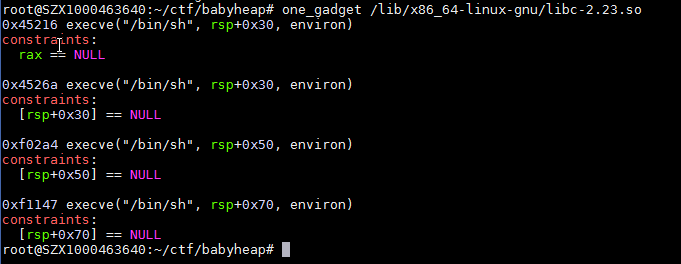

# 零碎的基础知识： 
1.fastbin和smallbin在main_arena中链表结构是不一样的。fastbin是单向链表，由fastbin指向chunk,但是smallbin/unsortbin/largebin都是双向链表，这样在free掉
上面所说的三个bin的时候，就会在fd以及bk上保存着main_arena+xx偏移的相应的基址，所以可以通过某种方式在free掉small/lagre/unsortbin之后将他们的fd或bk读出来 
2.one_gadget(用来找execve("/bin/sh")的) 
constraints是约束条件，在跳转到one_gadget之前必须满足的条件

# fastbin attak： 
核心思想是泄露libc基地址
